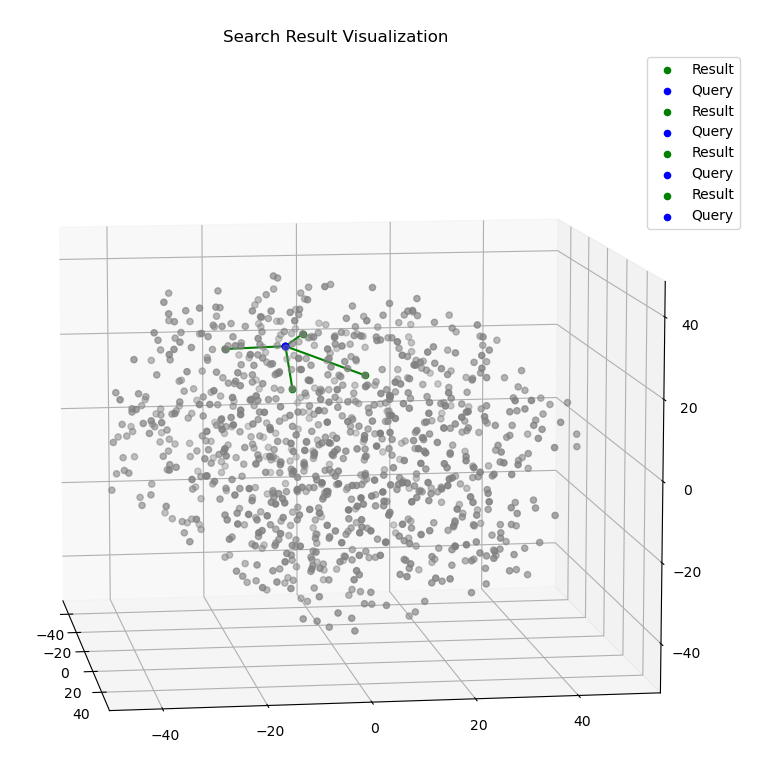
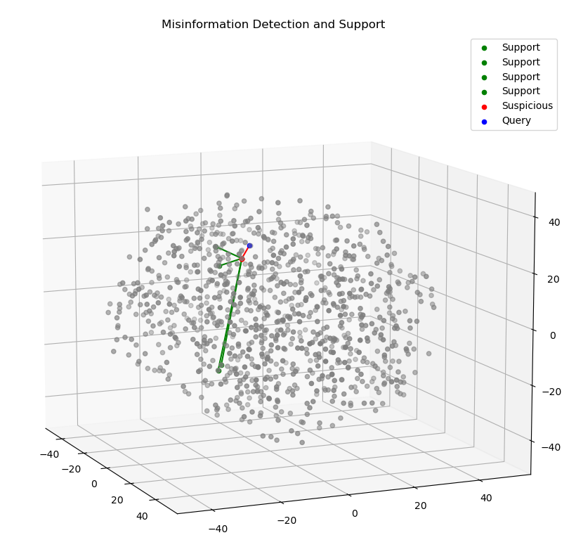

## SharedSight: Intelligent Search by the People ##

### Introduction: ###
SharedSight is a project designed to do efficient semantic search over news articles with misinformation detection built in. However, what sets SharedSight apart is it's ability to not just identify misinformation, but support it's decisions of whether a search result is misinformation with other articles via nested semantic search.
SharedSight was built on the [Huffington News Caption Dataset](https://www.kaggle.com/datasets/rmisra/news-category-dataset), although it can be generalized to work with any sufficiently large set of text.

### Installation: ###
The prerequisites for this project are as follows:
1. Anaconda or Miniconda
2. A CUDA Compatible GPU (optional for tensor acceleration)

To install SharedSight from source, do the following:
1. Run the following command:
```bash
conda env create -f env.yml
```
2. Download and extract the dataset from the [Huffington News Caption Dataset](https://www.kaggle.com/datasets/rmisra/news-category-dataset)
3. Activate the ```shared_sight``` conda environment
4. Set up the search indices, embedding banks, and search metadata by running the following script (Make sure to input the file to store the embedding vectors in and the dataset path):
```bash
python store_visualize.py
```

### Usage: ###
To run SharedSight, simply run the ```search.py``` script as follows:
```bash
python search.py [-v]
```
Note that the "-v" argument here is optional and will generate plots visualizing the topic space if set. This process greatly slows down search, but can provide some insight into the model's functionality.

SharedSight works by taking in search queries and returning responses, but it will also ask you to do your research and check its work. Users can note whether they believe a given search result they see is misinformation, and by analyzing the ratio between reported queries and normal queries SharedSight ensures dynamic misinformation detection. 

**Note that SharedSight does not delete suspected misinformation, rather it displays that information in its own column along with sources on why this information is suspicious. Information is variable, and SharedSight attempts to model this in its search process as it identifies misinformation.**

Search Result Visualization:

Misinformation Support Visualization:

